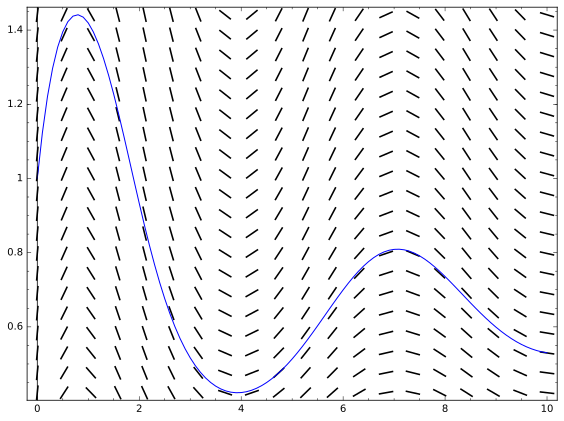

# حل معادلات دیفرانسیل معمولی
حل معادلات دیفرانسیل معمولی(ODE) از چندین طریق به شیوه های تحلیلی و عددی در این صفحه توضیح داده شده است.شایان ذکر است Sage هنوز از معادلات دیفرانسیل جزئی(PDE) پشتیبانی نمی کند.قبل از مطالعه این صفحه توصیه می شود موارد مربوط به مشتق گیری را در [این صفحه](sagemath-limit-derivative.md) مطالعه کنید.
## حل معادلات مرتبه اول و دوم
تابع `desolve` یک تابع کاربردی برای حل معادلات مرتبه اول و دوم است.ورودی های این تابع معادله دیفرانسیل موردنظر و تابعی است که قصد یافتن آنرا داریم.این تابع تعدادی پارامتر دیگر نیز می پذیرد که در ادامه آن ها را توضیح می دهیم.قبل از حل معادله بایستی متغیر و تابع بکار رفته در معادله را برای برنامه تعریف کرده باشیم.فرض کنید قصد داریم معادله ی زیر را حل کنیم:
$$ \frac{d^2y}{dx^2} + 2\frac{dy}{dx} - 3y = \sin(x) $$
```python
x = var('x')
y = function('y')(x)
desolve(diff(y, x, 2) + 2*diff(y, x) - 3*y == sin(x), y)
# output: _K2*e^(-3*x) + _K1*e^x - 1/10*cos(x) - 1/5*sin(x)
```
در این کد ابتدا `x` بعنوان یک متغیر نمادین و `y` بعنوان تابعی از `x` تعریف شده است.برنامه پس از اجرای دستور فوق پاسخ عمومی معادله را نمایش می دهد.اگر از رابط مرورگر Sage استفاده کنید و امکان Typeset را فعال کرده باشید، پاسخ به شکل زیر نمایش داده خواهد شد.
$$ K_2e^{(-3x)} + K_1e^x - \frac{1}{10}\cos(x) - \frac{1}{5}\sin(x) $$
در ادامه این صفحه به منظور خواناتر شدن معادلات فرض را بر فعال بودن این امکان می گذاریم.
در مواردی که بیش از یک متغیر در معادله بکار رفته بود می توانیم با استفاده از پارامتر `ivar` متغیر مستقل را به برنامه معرفی کنیم.برای مثال می خواهیم معادله زیر را حل کنیم.به طوریکه `a` عددی ثابت است:
$$ \frac{d^2y}{dx^2} + 2\frac{dy}{dx} - 3y = \sin(ax) $$
می توانیم بنویسیم:
```python
x, a = var('x a')
y = function('y')(x)
desolve(diff(y, x, 2) + 2*diff(y, x) - 3*y == sin(a*x), y, ivar=x)
```
خروجی به اینصورت خواهد بود:
$$K_1e^{(-3x)} + K_2e^x - \frac{2a\cos(ax) + (a^2 + 3)\sin(ax)}{a^4 + 10a^2 + 9}$$

### بدست آوردن جواب خصوصی
اگر با استفاده از پارامتر `ics` یک شرط اولیه برای تابع `desolve` مشخص کنیم، می توانیم به جای جواب عمومی معادله، یک جواب خصوصی آن را بدست آوریم.دقت کنید اگر معادله از مرتبه اول باشد، شرط اولیه را به صورت یک لیست با ترتیب زیر می نویسیم:
$$ x_0, y_0 $$
اگر معادله از مرتبه دوم بود، ترتیب به صورت زیر خواهد بود:
$$ x_0,\, y(x_0),\, y'(x_0) $$

برای مثال می خواهیم معادله قبل را با شرایط زیر حل کنیم:
$$ x_0 = 0,\, y(x_0) = 0,\, y'(x_0) = 0 $$
می توانیم بنویسیم:
```python
x = var('x')
y = function('y')(x)
desolve(diff(y, x, 2) + 2*diff(y, x) - 3*y == sin(x), y, ics=[0, 0, 0])
```
خروجی به شکل زیر است:
$$ \frac{1}{8}e^x - \frac{1}{40}e^{(-3x)} - \frac{1}{5}\sin(x) - \frac{1}{10}\cos(x) $$
### امکان حل تعدادی معادله خاص
امکان حل تعدادی از معادلات دیفرانسیل خاص مانند معادلات لاگرانژ، ریکاتی، کلرو و تعدادی دیگر به طور پیشفرض غیرفعال است چرا که ممکن است زمان بدست آوردن پاسخ آن ها نسبتا طولانی شود.برای فعال سازی امکان حل این معادلات می توانیم پارامتر `contrib_ode` را با مقدار `True` به تابع `desolve` پاس دهیم.برای مثال معادله زیر که از نوع کلرو است را در نظر بگیرید:
$$ (\frac{dy}{dx})^2 + x\frac{dy}{dx} - y = 0 $$
```python
x = var('x')
y = function('y')(x)
desolve(diff(y, x)^2 + x*diff(y, x)-y == 0, y, contrib_ode=True)
```
خروجی کد بالا یک لیست حاوی یک جواب عمومی و یک جواب خصوصی معادله به صورت زیر است:
$$ y(x) = C^2 + Cx $$
$$ y(x) = -\frac{1}{4}x^2 $$
## حل معادلات دیفرانسیل با تبدیل لاپلاس
یکی از توابعی که می توانیم برای حل معادلات با مرتبه بالاتر از دو از آن استفاده کنیم، تابع `desolve_laplace` است که از تبدیل لاپلاس برای حل معادلات استفاده می کند. معادله مورد نظر و تابعی که قصد پیدا کردن آن را داریم ورودی های این تابع هستند.مشخص کردن شرایط اولیه اختیاری است.برای مشخص کردن شرایط اولیه آن ها را در یک لیست به ترتیب زیر می نویسیم:
$$ x_0,\,y(x_0),\,y'(x_0),\,y''(x_0),\,... $$
فرض کنید بخواهیم معادله زیر را حل کنیم.
$$ \frac{d^2y}{dx^2} - y = 0,\, y(0) = 1,\, y'(0) = 4 $$
```python
x = var('x')
y = function('y')(x)
desolve_laplace(diff(y, x, 2) - y == 0, y, ics=[0, 1, 4])
```
خروجی به صورت زیر خواهد بود:
$$ -\frac{3}{2}e^{(-x)} + \frac{5}{2}e^x $$
البته مشخص کردن شرایط اولیه اختیاری است.مثلا کد زیر و نتیجه آن را ببینید:
```python
x = var('x')
y = function('y')(x)
desolve_laplace(diff(y, x, 2) - y == 0, y)
# output: 1/2*(y(0) - D[0](y)(0))*e^(-x) + 1/2*(y(0) + D[0](y)(0))*e^x
```
## حل دستگاه معادلات دیفرانسیل
با استفاده از تابع `desolve_system` می توان یک دستگاه از معادلات دیفرانسیل مرتبه اول را حل کرد.برای استفاده از این تابع لازم است یک لیست از معادلات و سپس لیستی حاوی توابعی که به دنبال آن ها هستیم به تابع پاس دهیم.به مثال زیر دقت کنید.
$$ \frac{dx}{dt} - y + z = 0 $$
$$ \frac{dy}{dt} + x - z = 0 $$
$$ \frac{dz}{dt} + y - x = 0 $$
$$ x(0) = 1,\, y(0) = 2,\, z(0) = 3 $$

```python
t = var('t')
x = function('x')(t)
y = function('y')(t)
z = function('z')(t)
de1 = diff(x, t) - y + z  == 0
de2 = diff(y, t) + x - z  == 0
de3 = diff(z, t) + y - x  == 0
desolve_system([de1, de2, de3], [x, y, z], ivar=t, ics=[0, 1, 2, 3])
```
خروجی برنامه یک لیست حاوی سه تابع زیر خواهد بود:
$$ x(t) = -\frac{1}{3}\sqrt{3}\sin{(\sqrt{3}t)} - \cos{(\sqrt{3}t) + 2} $$
$$ y(t) = \frac{2}{3}\sqrt{3}\sin{(\sqrt{3}t)} + 2 $$
$$ z(t) = -\frac{1}{3}\sqrt{3}\sin{(\sqrt{3}t)} + \cos{(\sqrt{3}t)} + 2 $$
## حل عددی معادلات دیفرانسیل
### حل عددی معادلات مرتبه اول با روش رونگه-کوتا
چند تابع برای حل عددی معادلات دیفرانسیل در Sage تعریف شده اند. یکی از آن ها تابع `desolve_rk4` است که با استفاده از روش رونگه-کوتای مرتبه چهار معادلات دیفرانسیل مرتبه اول را به صورت عددی حل می کند.مثال زیر را در نظر بگیرید.
$$ (t + y)\frac{dy}{dt} = (\cos(y+t) + \sin(y-t))y $$
$$ t_0 = 0,\,y(t_0) = 1 $$
تابع از شرط اولیه بالا شروع می کند.به اندازه پارامتر `step` به `t_0` اضافه می شود تا به نقطه ای که در پارامتر `end_points` مشخص شده برسد.با این روش می توان مقدار تقریبی یکی از منحنی هایی که در معادله بالا صدق می کند را در تعدادی نقطه بدست آورد.این برنامه را بصورت زیر می نویسیم.خروجی برنامه بعد از آن آمده است:
```python
t = var('t')
y = function('y')(t)
desolve_rk4((t+y)*diff(y, t)  == (cos(y+t) + sin(y-t)) * y, y, ics=[0,1], end_points=10, step=1)
# output:
# [[0, 1],
# [1.0, 1.407887032351052],
# [2.0, 0.9259729560604678],
# [3.0, 0.5127347721183819],
# [4.0, 0.4198461330188371],
# [5.0, 0.5097328973391273],
# [6.0, 0.6944728770297238],
# [7.0, 0.8029210116006918],
# [8.0, 0.7301885057700976],
# [9.0, 0.594515120460231],
# [10.0, 0.5260168340620006]]
```
از قابلیت های جالب این تابع این است که اگر پارامتر `output` را با مقدار `slope_field` به آن پاس دهیم آنگاه منحنی بدست آمده و شیب میدان معادله دیفرانسیل را رسم کرده و نمایش می دهد.برای مثال برای معادله قبلی داریم:
```python
t = var('t')
y = function('y')(t)
p = desolve_rk4((t+y)*diff(y, t)  == (cos(y+t) + sin(y-t)) * y, y, ics=[0,1], output='slope_field', end_points=10, step=0.1)
show(p)
```
خروجی این کد تصویر زیر است:
  
