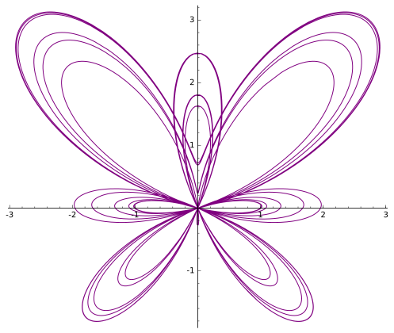

# قابلیت های SageMath

برخی از زمینه های ریاضیات که SageMath در آن ها بسیار مفید است را می توان اینگونه برشمرد:

- حساب دیفرانسیل و انتگرال
- آمار و احتمال
- نظریه گراف
- ترکیبیات
- ماتریس ها و جبر خطی
- آنالیز عددی
- نظریه کدگذاری
- جبر مجرد
- نظریه اعداد
- هندسه
- منطق
- نظریه بازی ها

موارد نامبرده شده تنها بخشی از کاربرد های گسترده SageMath است. 

## گردشی در SageMath
در این صفحه مثال هایی از قابلیت های این برنامه آورده شده است.بعد از هر کد نتیجه اجرای آن نمایش داده شده است.موارد مطرح شده در این صفحه صرفا برای نشان دادن قابلیت های این برنامه مطرح شده اند.

مثال هایی از محاسبات معمول:

```python
5*8+9
# 49
7%3
# 1
2^64
# 18446744073709551616
(2 + 3*I) - (7 - 9*I)
# 12*I - 5
```
توابع مختلفی در SageMath تعریف شده اند:
```python
sin(pi/3)
# 1/2*sqrt(3)
sin(pi/3).n()
# 0.866025403784439
log(e^3)
# 3
gamma(5)
# 24
sqrt(-1)
# I
```
فرض کنید قصد حل معادله زیر را داریم:
$$ x^2+4x-15=0 $$
```python
solve(x^2 + 4*x -15, x)
# [x == -sqrt(19) - 2, x == sqrt(19) - 2]
```
امکان ریشه یابی معادلات با شیوه های عددی هم وجود دارد.
$$ \cos{x} = x $$

```python
find_root(cos(x) == x, 0, 1)
# 0.7390851332151559
```
حل دستگاه معادلات:
$$\begin{align}x_1 - 2x_2 + x_3 &= 5 \\\\ 3x_1 + 4x_2 - x_3 &= 7 \\\\ -x_1 -x_2 +2x_3 &= -3\end{align}$$
```python
x1,x2,x3 = var('x1,x2,x3')
solve([x1 - 2*x2 + x3 == 5, 3*x1 + 4*x2 - x3 == 7, -x1 -x2 +2*x3 == -3], [x1, x2, x3])
# [[x1 == (31/9), x2 == (-8/9), x3 == (-2/9)]]
```
تعریف توابع:
```python
f(x,y) = x^2 + y^2 -1
f(0.25, 0.75)
# -0.375000000000000
```
محاسبه انتگرال معین و نامعین:
$$ \int^1_{-1}{\sqrt{1-x^2}\,dx} $$

```python
integral(sqrt(1-x^2), x, -1, 1)
# 1/2*pi
integral(sqrt(1-x^2), x)
# 1/2*sqrt(-x^2 + 1)*x + 1/2*arcsin(x)
```
مثالی از حل معادلات دیفرانسیل:

$$ \frac{d^2y}{dx^2} + \frac{dy}{dx} - y = 0 $$
```python
y = function('y')(x)
desolve(diff(y, x, 2) + diff(y, x) - y==0, y)
# _K2*e^(-1/2*x*(sqrt(5) + 1)) + _K1*e^(1/2*x*(sqrt(5) - 1))
```
یافتن رگرسیون:
```python
a,b,x = var('a,b,x')
model(x) = a*x + b
data = [(0, 2), (2, 6), (3, 9.5), (4, 11), (5, 17.5), (7, 26)]
find_fit(data, model)
# [a == 3.4576271186494285, b == -0.10169491525664309]
```
رسم یک نگاشت:

$$ y = \sin{x}\cos{\frac{x}{\pi}} $$
```python
plot(sin(x)*cos(x/pi), (x, -2*pi, 2*pi), ticks=pi/2, tick_formatter=pi)
```

رسم نگاشت و انیمیشن:
```python
c = [plot(sin(x)*cos(x*(i*pi)), (x, -2*pi, 2*pi), ticks=pi/2, tick_formatter=pi, ymin=-1, ymax=1) for i in sxrange(0, 1, 0.02) ]
a = animate(c)
a.show()
```


---
رسم منحنی پارامتری:
$$ \begin{align} x(t) &= \sin{\pi t} \\\\ y(t) &= \cos{4t}\end{align}$$
```python
t = var('t')
parametric_plot( (sin(pi*t), (cos(4*t))), (t, -5, 5))
```


رسم سه بعدی:

$$ z = x^2 + y^2 $$
```python
x,y = var('x y')
plot3d(x^2+y^2, (x, -10, 10), (y, -10, 10))
```

