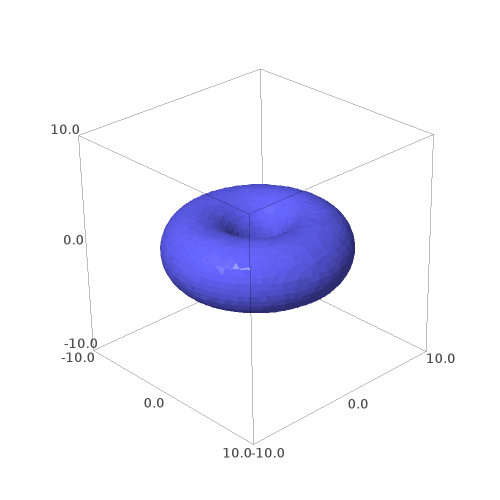

# قابلیت های SageMath

برخی از زمینه های ریاضیات که SageMath در آن ها بسیار مفید است را می توان اینگونه برشمرد:

- حساب دیفرانسیل و انتگرال
- آمار و احتمال
- نظریه گراف
- ترکیبیات
- ماتریس ها و جبر خطی
- آنالیز عددی
- نظریه کدگذاری
- جبر مجرد
- نظریه اعداد
- هندسه
- منطق
- نظریه بازی ها

موارد نامبرده شده تنها بخشی از کاربرد های گسترده SageMath است. 


## قابلیت پردازش نمادین
امکانات پردازش نمادین (Symbolic Computation) قدرتنمد SageMath آن را از بسیاری نرم افزار های مشابه متمایز کرده است.به مثال زیر دقت کنید:
```python
x = var('x')
y = function('y')(x)
```
کد فوق `x` را به عنوان متغیری نمادین و `y` را به عنوان تابعی از `x` تعریف می کند. پس از این تعریف قادر به انجام محاسبات نمادین بر روی موارد تعریف شده هستیم.به عنوان مثال:

```python
derivative(sin(y)^2)
```
عبارت زیر نتیجه اجرای کد بالا است:

```
2*cos(y(x))*sin(y(x))*D[0](y)(x)
```
به طوریکه منظور از `D[0](y)(x)` مشتق `y` نسبت به `x` است.

نکته دیگری که باید بدانید این است توسعه ی بسیاری از ساختار های ریاضی در Sage در چهارچوب مفاهیم جبر مجرد انجام شده است. به عنوان مثال کد زیر و خروجی آن را در نظر بگیرید:

```python
t = var('t')
factor(t^2-2)
# output : t^2 - 2
```
در برنامه فوق تابع `factor` چند جمله ای را تجزیه می کند. اما در کد زیر یک چند جمله ای روی حلقه اعداد حقیقی تعریف کرده و دوباره از آن فاکتورگیری می کنیم.(در Sage حلقه اعداد حقیقی با `RR` نمایش داده می شود.):

```python
realpoly.<t> = PolynomialRing(RR)
factor(t^2-2)
# output : (t - 1.41421356237310) * (t + 1.41421356237310)
```
جالب این است که می توانید در این چهارچوب ساختار های جدید ریاضی را برای Sage تعریف کنید.

با قدرت محاسبات نمادین و توسعه در چهارچوب جبر مجرد دیگر نباید از قدرت Sage در حل مسائل به شیوه های تحلیلی تعجب کنید(در ادامه مثال هایی آورده شده است.) اما باید بدانید با این وجود Sage در روش های عددی هم حرف های زیادی برای گفتن دارد. 

## توسعه با استفاده از زبان Python
همانطور که در صفحات قبلی اشاره شد، توسعه دهندگان Sage به جای ابداع یک زبان برنامه نویسی جدید، برنامه را با زبان Python توسعه می دهند.Sage سادگی، قدرت و سرعت را از Python به ارث برده است.علاوه بر این موضوع می توانید ماژول های متنوع زبان Python را در Sage مورد استفاده قرار دهید. مثال زیر نشانگر این است که ترکیب Pytohn و Sage بیشتر از یک نرم افزار ساده ریاضیات است.

در زبان پایتون کتابخانه ای به نام `Requests` وجود دارد. یکی از کاربرد های این کتابخانه استفاده از وب سرویس های اینترنتی است.برنامه ای که در ادامه کد و نتیجه آن را مشاهده می کنید با استفاده از این کتابخانه قیمت هر تن فلز مس را از اولین روز سال 2017 تا اکنون از یک پایگاه داده مربوط به بورس فلزات لندن دریافت می کند سپس با استفاده از برازش یک چند جمله ای درجه 3 بر اساس داده های دریافتی مدلی را برای تخمین قیمت هرتن بر حسب روز، محاسبه می کند. در ادامه داده های دریافتی و مدل حاصل را به صورت نمودار نمایش می دهد.

 ```python
import requests

api_url = "https://www.quandl.com/api/v3/datasets/LME/PR_CU.json?api_key=API_KEY&start_date=2017-01-01"

# دریافت داده ها از دیتابیس
data = requests.get(api_url).json()['dataset']['data']

# قرار دادن داده ها به صورت زوج مرتب در یک لیست
i = 1
prices = []
for day in data:
    prices.append([i, day[1]])
    i += 1
    
# تعریف یک تابع درجه سه و برازش آن
b1, b2, b3, b4 = var('b1, b2, b3, b4')
model(x) = b1*x^3 + b2*x^2 + b3*x + b4
params = find_fit(prices, model, solution_dict=True)
fit_line = params[b1]*x^3 + params[b2]*x^2 + params[b3]*x + params[b4]

# رسم نقاط
p1 = list_plot(prices)
# رسم تابع بدست آمده
p2 = plot(fit_line, (x, 1, 180), color='red')
# نمایش هر دو شکل ترسیم شده
(p1 + p2).show()
```


## گردشی در SageMath
در ادامه مثال هایی پراکنده از قابلیت های این برنامه آورده شده است.بعد از هر کد نتیجه اجرای آن نمایش داده شده است.موارد مطرح شده در این صفحه صرفا برای نشان دادن قابلیت های این برنامه مطرح شده اند. در هنگام مرور این مثال ها به توانایی پردازش نمادین SageMath دقت کنید.نگران ناخوانا بودن خروجی نباشید.اگر از notebook این برنامه استفاده کنید می توانید عبارات ریاضی را به صورت زیبا و خوانا مشاهده کنید.کد های زیر در رابط خط فرمان برنامه نوشته شده است.

مثال هایی از محاسبات معمول:

```python
5*8+9
# 49
7%3
# 1
2^64
# 18446744073709551616
(2 + 3*I) - (7 - 9*I)
# 12*I - 5
```
---
توابع مختلفی در SageMath تعریف شده اند:
```python
sin(pi/3)
# 1/2*sqrt(3)
sin(pi/3).n()
# 0.866025403784439
log(e^3)
# 3
gamma(5)
# 24
sqrt(-1)
# I
```
---
فرض کنید قصد حل معادله زیر را داریم:
$$ x^2+4x-15=0 $$
```python
solve(x^2 + 4*x -15, x)
# [x == -sqrt(19) - 2, x == sqrt(19) - 2]
```

امکان ریشه یابی معادلات با شیوه های عددی هم وجود دارد.
$$ \cos{x} = x $$

```python
find_root(cos(x) == x, 0, 1)
# 0.7390851332151559
```
حل دستگاه معادلات:
$$\begin{align}x_1 - 2x_2 + x_3 &= 5 \\\\ 3x_1 + 4x_2 - x_3 &= 7 \\\\ -x_1 -x_2 +2x_3 &= -3\end{align}$$
```python
x1,x2,x3 = var('x1,x2,x3')
solve([x1 - 2*x2 + x3 == 5, 3*x1 + 4*x2 - x3 == 7, -x1 -x2 +2*x3 == -3], [x1, x2, x3])
# [[x1 == (31/9), x2 == (-8/9), x3 == (-2/9)]]
```

محاسبه مجموع سری:

$$\sum^{\infty}_{k=1}{\frac{1}{k^2}}$$
```python
k = var('k')
sum(1/k^2, k, 1, oo)
# 1/6*pi^2
```


یافتن رگرسیون:
```python
a,b,x = var('a,b,x')
model(x) = a*x + b
data = [(0, 2), (2, 6), (3, 9.5), (4, 11), (5, 17.5), (7, 26)]
find_fit(data, model)
# [a == 3.4576271186494285, b == -0.10169491525664309]
```

---

تعریف توابع:
```python
f(x,y) = x^2 + y^2 -1
f(0.25, 0.75)
# -0.375000000000000
```
محاسبه حد یک تابع:

$$ \lim_{x\to0} \frac{\sin{x}}{x} $$
```python
limit(sin(x)/x, x=0)
# 1
```

محاسبه مشتق یک تابع:

$$ f(x) = \frac{sin(x^3)cos(5x)}{1+x^2} $$
```python
f(x) = sin(x^3)*cos(5*x)/(1+x^2)
f(x).derivative()
# 3*x^2*cos(x^3)*cos(5*x)/(x^2 + 1) - 2*x*cos(5*x)*sin(x^3)/(x^2 + 1)^2 - 5*sin(x^3)*sin(5*x)/(x^2 + 1)
```


محاسبه انتگرال معین و نامعین:
$$ \int^1_{-1}{\sqrt{1-x^2}\,dx} $$

```python
integral(sqrt(1-x^2), x, -1, 1)
# 1/2*pi
integral(sqrt(1-x^2), x)
# 1/2*sqrt(-x^2 + 1)*x + 1/2*arcsin(x)
```
مثالی از حل معادلات دیفرانسیل:

$$ \frac{d^2y}{dx^2} + \frac{dy}{dx} - y = 0 $$
```python
y = function('y')(x)
desolve(diff(y, x, 2) + diff(y, x) - y==0, y)
# _K2*e^(-1/2*x*(sqrt(5) + 1)) + _K1*e^(1/2*x*(sqrt(5) - 1))
```
محاسبه بسط تیلور یک تابع:
```python
taylor(cos(x), x, 0, 6)
# -1/720*x^6 + 1/24*x^4 - 1/2*x^2 + 1
```


مثالی از محاسبه تبدیل لاپلاس:

$$ \mathcal{L}\\{\cos{(at+b)}\\} $$
```python
a, b, t, s = var('a b t s')
f(t) = cos(a*t+b)
laplace(f(t), t, s)
# (s*cos(b) - a*sin(b))/(a^2 + s^2)
```


رسم یک تابع:

$$ y = \sin{x}\cos{\frac{x}{3}} $$
```python
plot(sin(x)*cos(x/3), (x, -2*pi, 2*pi), ticks=pi/2, tick_formatter=pi)
```


رسم تابع و ساخت انیمیشن از تصاویر رسم شده:
```python
c = [plot(sin(x)*cos(x*i*pi), (x, -2*pi, 2*pi), ticks=pi/2, tick_formatter=pi, ymin=-1, ymax=1) for i in sxrange(0, 1, 0.02) ]
a = animate(c)
a.show()
```


رسم پارامتری منحنی پروانه:
$$ \begin{align}
    x(t) &= \sin{(t)}\Big(e^{\cos{t}} - 2\cos{4t} - \sin^5{\big(\frac{t}{12}\big)}\Big)\\\\
    y(t) &= \cos{(t)}\Big(e^{\cos{t}} - 2\cos{4t} - \sin^5{\big(\frac{t}{12}\big)}\Big)\\\\
\end{align} $$
$$ 0 \le t \le 12\pi $$
```python
t = var('t')
x(t) = sin(t)*( e^(cos(t)) - 2*cos(4*t) - sin(t/12)^5 )
y(t) = cos(t)*( e^(cos(t)) - 2*cos(4*t) - sin(t/12)^5 )
parametric_plot((x(t), y(t)), (t, 0, 12*pi), color='purple', plot_points=1000)```


رسم یک منحنی قطبی:

$$ r = sin^3(4\theta) - cos(4\theta) $$
$$ 0 \le \theta \le 2\pi $$

```python
theta = var('theta')
polar_plot(sin(4*theta)^3 - cos(4*theta), (theta, 0, 2*pi), color='#674172', fill=true, fillcolor='#674172', fillalpha=1)
```


رسم یک چنبره:

$$ (x^2 + y^2 + z^2 + 16)^2 = 100(x^2 + y^2) $$
```python
x,y,z = var('x y z')
implicit_plot3d((x^2 + y^2 + z^2 + 16)^2 == 100*(x^2 + y^2), (x, -10, 10), (y, -10, 10), (z, -10, 10))
```




---

کار با ماتریس ها:
$$ A = \left(\begin{array}{rrr}
1 & 0 & 8 \\\\
-9 & 2 & 1 \\\\
0 & 1 & 2
\end{array}\right) \, B = \left(\begin{array}{rrr}
3 & 2 & 1 \\\\
7 & 6 & 7 \\\\
1 & 3 & 3
\end{array}\right) $$
```python
# تعریف دو ماتریس
A = Matrix([ [1, 0, 8], [-9, 2, 1], [0, 1, 2] ])
B = Matrix([ [3, 2, 1], [7, 6, 7], [1, 3, 3] ])

# مجموع دو ماتریس
A+‌B
#[ 4  2  9]
#[-2  8  8]
#[ 1  4  5]
# ضرب دو ماتریس
A*B
#[ 11  26  25]
#[-12  -3   8]
#[  9  12  13]
# دترمینان ماتریس
A.det()
# -69
# وارون ماتریس
A.inverse()
#[-1/23 -8/69 16/69]
#[-6/23 -2/69 73/69]
#[ 3/23  1/69 -2/69]
```

---

کار با گراف ها:
```python
# معرفی متغیر به عنوان یک گراف
G = Graph()
# افزودن رئوس گراف
G.add_vertices(['a', 'b', 'c', 'd', 'e'])
# افزودن یال های گراف
G.add_edges([['a', 'b'], ['b', 'c'], ['c', 'd'], ['d', 'e'], ['e', 'a'], ['b', 'e'], ['c', 'e']])
# نمایش ماتریس مجاورت این گراف
G.adjacency_matrix()
#[0 1 0 0 1]
#[1 0 1 0 1]
#[0 1 0 1 1]
#[0 0 1 0 1]
#[1 1 1 1 0]
# نمایش مسیر های بین دو راس
G.all_paths('a', 'b')
#[['a', 'b'], ['a', 'e', 'b'], ['a', 'e', 'c', 'b'], ['a', 'e', 'd', 'c', 'b']]
# بررسی درخت بودن گراف
G.is_tree()
#False
# بررسی اویلری بودن گراف
G.is_eulerian()
#False
# بررسی همیلتونی بودن گراف
G.is_hamiltonian()
#True
# نمایش گراف
plot(G)
# تصویر زیر نتیجه اجرای دستور نمایش گراف است.
```


---

کاربرد هایی در منطق گزاره ها  

رسم جدول درستی یک گزاره:
$$ (p\rightarrow q) \leftrightarrow \neg a $$
```python
f = propcalc.formula("(p->q)<->~a")
f.truthtable()
# p      q      a      value
# False  False  False  True   
# False  False  True   False  
# False  True   False  True   
# False  True   True   False  
# True   False  False  False  
# True   False  True   True   
# True   True   False  True   
# True   True   True   False 
```
بررسی راستگویی یک گزاره:
```python
f = propcalc.formula("(p|q)|(~p&~q)")
f.is_tautology()
# True
```
بررسی سازگاری یک سیستم:
```python
f, g, h, i = propcalc.get_formulas("a<->b", "~b->~c", "d|g", "c&a")
propcalc.consistent(f, g, h, i)
# True
```
