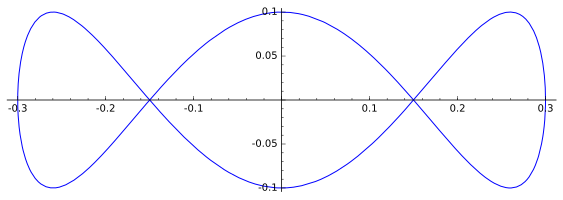
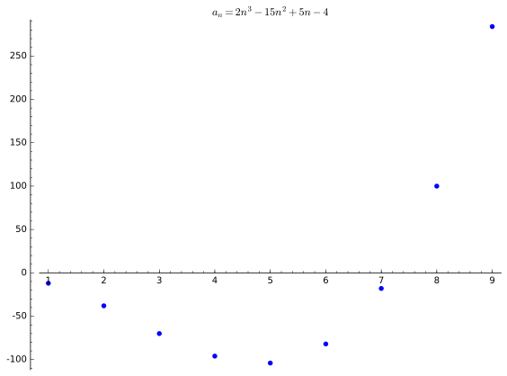

# ترسیم در Sagemath
در این بخش قابلیت های ترسیم Sage توضیح داده شده است. توصیه می شود قبل از این بخش قسمت های [کار با توابع](sagemath-functions.md) و [مفاهیم پایه](sagemath-fundamentals.md) را ببینید.

## ترسیم دو بعدی توابع در دستگاه دکارتی
در Sage تابع `plot` یکی از توابع مهم ترسیم است. این تابع امکانات زیادی دارد و یک راه خوب برای یادگیری این قابلیت ها توجه به مثال های استفاده از این تابع است.در این صفحه مثال های مهمی از این تابع آورده شده است.اما قبل از آوردن مثال ها لازم است با برخی  از تنظیمات تابع `plot` آشنا شوید.استفاده از تابع `plot` به صورت `plot(X, ...)` است. به طوری که `X` شیئ است که قصد رسم آن را داریم و باقی ورودی ها تنظیمات این تابع است. در حالتی که `X` یک تابع باشد باید بعد از `X` محدوده هر متغیر را هم به تابع پاس داد.جدول زیر نشان دهنده تنظیمات این تابع است. با کمک این جدول می توان طیف وسیعی از نمودار ها را رسم کرد.

| نام پارامتر ورودی | توضیحات |
| ----------------- | ------- |
| `plot_points` | تعداد نقاط مورد استفاده برای رسم.با افزایش این مقدار دقت رسم بالاتر می رود. |
| `scale` | مقیاس نمودار. این پارامتر از نوع رشته بوده و مقیاس رسم را تعیین می کند. مقدار پیشفرض آن `"linear"` است. اگر مقدار آن برابر با `"loglog"` باشد آنگاه مقیاس نمودار لگاریتمی خواهد بود.اگر بخواهیم تنها محور افقی و یا تنها محور عمودی با این مقیاس رسم شود می توان به ترتیب از مقادیر `"semilogx"` و `"semilogy"` استفاده کرد.|
| `base` | اگر مقیاس نمودار لگاریتمی باشد، تعیین کننده پایه لگاریتم مقیاس است. به طور پیشفرض برابر با `10` است. |
| `xmin` | مقداری که محور افقی از آن شروع می شود |
| `xmax` | مقداری که محور افقی در آن پایان می یابد |
| `ymin` | کمترین مقدار محور عمودی |
| `ymax` | بیشترین مقدار محور عمودی |
| `color` | رنگ رسم نمودار. با این پارامتر می توان رنگ نمودار را تعیین کرد.می تواند برابر با نام رنگ باشد مثل `"red"` و یا می تواند برابر با کد hex رنگ مورد نظر باشد مثل `"#2d2d2d"` و یا می تواند برابر با مقدار رنگ به صورت rgb باشد مثل `(0, 0, 0.6)`. |
| `detect_poles` | به صورت پیشفرض برابر با `False` است.اگر برابر با `"show"` باشد، مجانب های عمودی نمودار را نمایش می دهد. |
| `legend_label` | تنظیم یک متن برای نمودار |
| `legend_color` | تنظیم رنگ متن نمودار. مقادیر آن مثل پارامتر `color` است. |
| `title` | یک متن که برای عنوان نمودار استفاده می شود. |
| `alpha` | این پارامتر از صفر تا یک بوده و میزان شفافیت نمودار را تعیین می کند. |
| `thickness` | این پارامتر میزان ضخامت نمودار را تعیین می کند. |
| `linestyle` | نوع خط نمودار را تعیین می کند. به طور پیشفرض برابر با `"-"` است. اگر برابر با `"--"` یا `"dashed"` باشد نمودار به صورت خط چین رسم می شود.دیگر مقادیری که می توان برای در نظر گرفت `"dash_dot"` و `"dotted"` است. |
| `fill` | این پارامتر برای رنگ آمیزی نمودار استفاده می شود.‌به طور پیشفرض مقدار آن `False` است.اگر مقدار آن برابر `True` و یا `"axis"` باشد، ناحیه بین تابع و محور افقی را رنگ آمیزی می کند.اگر برابر `"max"` باشد ناحیه بالای نمودار و اگر برابر با `"min"` باشد ناحیه پایین نمودار را رنگ آمیزی می کند.همچنین می توان یک تابع را به عنوان مقدار آن در نظر گرفت که در این صورت ناحیه بین آن تابع و نمودار را رنگ آمیزی می کند.|
| `fillcolor` | رنگ مورد استفاده برای رنگ آمیزی نمودار که مقدار آن مانند `color` است. |
| `fillalpha` | تعیین میزان شفافیت رنگ مورد استفاده که مقادیر آن مانند `alpha` است.|

باقی تنظیمات در قالب مثال مطرح شده است.بعد از هر کد نمودار حاصل آورده شده است.  

مثالی ساده از رسم یک سهمی
```python
p = plot(x^2, (x, -2 , 2))
show(p)
```
  
مثالی از تغییر مقیاس محور افقی

```python
p = plot(sin(x) + cos(3*x), (x, -2*pi, 2*pi), ticks=pi/2, tick_formatter=pi)
show(p)
```
  
تغییر رنگ نمودار
```python
p = plot(x*sin(1/x), (x, -pi, pi), ticks=pi/2, tick_formatter=pi, color='purple')
show(p)
```
  
در sage عمل جمع بر روی اشیاء رسم شده تعریف شده است و برای نمایش چند نمودار می توان آن ها را باهم جمع کرد.

```python
p1 = plot(x^3, (x, -3, 3), color='green')
p2 = plot(x^2, (x, -3, 3), color='black')
show(p1 + p2)
```
  
نوشتن متن برای نمودار ها
```python
p1 = plot(sin(x), (x, -2*pi, 2*pi), color='red', legend_label='sin(x)')
p2 = plot(cos(x), (x, -2*pi, 2*pi), color='black', legend_label='cos(x)')
show(p1 + p2)
```
  
تغییر ضخامت و نوع خط نمودار
```python
p1 = plot(sin(x), (x, -2*pi, 2*pi), color='red', legend_label='sin(x)', thickness=2)
p2 = plot(cos(x), (x, -2*pi, 2*pi), color='black', legend_label='cos(x)', linestyle=':')
show(p1 + p2)
```
  
تغییر مقیاس نمودار
```python
p = plot(e^x, (x, 0, 30), scale='loglog')
show(p)
```
  
رنگ آمیزی نمودار

```python
p = plot(sin(x), (x, 0, 2*pi), color='#EF4836', fill=True, fillcolor='#EF4836', fillalpha=1, title='$f(x) = \sin{x}$')
show(p)
```
  
رنگ آمیزی ناحیه بین دو نمودار
```python
p1 = plot(1/4*sin(x), (x, -2*pi, 2*pi), fill=cos(x))
p2 = plot(cos(x), (x, -2*pi, 2*pi), color='red')
show(p1+p2)
```
  
نمایش مجانب های عمودی
```python
p = plot(csc(x), (x, -2*pi, 2*pi), ticks=pi/2, tick_formatter=pi, ymax=10, ymin=-10, detect_poles='show')
show(p)
```
  

## ترسیم منحنی های پارامتری
برای رسم منحنی های پارامتری می توان از تابع `parametric_plot` استفاده کرد.اغلب ورودی های این تابع مانند تابع `plot` است. ورودی اول این تابع یه زوج مرتب است که مولفه های آن به ترتیب توابع `(t)x` و `y(t)` هستند. دقت کنید `t` و یا هر متغیر دیگری که از آن به عنوان متغیر مستقل استفاده می کنید باید به عنوان متغیر نمادین معرفی شود. به مثال زیر توجه کنید.

```python
t = var('t')
p = parametric_plot((0.3*cos(0.1*t), 0.1*sin(0.3*t)), (t, 0, 20*pi))
show(p)
```

  
## رسم معادلات ضمنی
رسم معادلات ضمنی توسط تابع `implicit_plot` انجام می شود.فراموش نکنید که `x` و `y` را به عنوان متغیر نمادین معرفی کنید.
```python
x, y = var('x y')
p = implicit_plot(2*sin(3*x) + 3*cos(2*y) == 2*cos(x) + 3*sin(x), (x, -2*pi, 2*pi), (y, -2*pi, 2*pi))
show(p)
```

  
## ترسیم در دستگاه قطبی
برای رسم منحنی های قطبی می توان از تابع `polar_plot` استفاده کرد. شیوه استفاده از این تابع همانند  استفاده از تابع `plot` است.
```python
p = polar_plot(sin(3*x/7), (x, 0, 7*pi))
show(p)
```

  

## رسم پاره خط
برای رسم یک پاره خط می توان از تابع `line` استفاده کرد.اولین ورودی این تابع یک لیست از نقاط ابتدا و انتها است.باقی پارامتر ها اختیاری هستند.مثال زیر یک شکل را با کمک این تابع رسم می کند.
```python
p = plot([])
n = 15
for i in range(1, n+1):
    p += line([(i, 0), (0, n-i+1)], thickness=0.5, color='#2d2d2d')
show(p, axes=False)
```

  
## افزودن نوشته به نمودار
برای نوشتن یک متن از تابع `text` استفاده می کنیم. خروجی آن که یک شیئ گرافیکی است را می توانیم با نموداری دیگر جمع کنیم.اولین ورودی این تابع متن مورد نظر و ورودی بعدی مختصات قرار گیری آن در صفحه است.
```python
t = text("Sage Tutorials", (3, 10))
show(t)
```
  
همچنین می توانید در متنی که به این تابع پاس می دهید دستورات لاتک هم بنویسید.توضیح باقی پارامتر های این تابع در [این صفحه](http://doc.sagemath.org/html/en/reference/plotting/sage/plot/text.html#sage.plot.text.text) آمده است.  
مثالی از نمودار حاوی متن
```python
p1 = plot(sin(x), (x, 0, 2*pi), color='#2d2d2d', ticks=pi/2, tick_formatter=pi)
p2 = plot(sin(x), (x, 0, pi), fill=True, fillcolor='#2d2d2d', fillalpha=1, color='#2d2d2d')
txt = text("$\int^{\pi}_{0}{\sin{x}\,dx}$", (pi/2, 0.3), color='white', fontsize=22)
(p1+p2+txt).show()
```
  
## رسم نقاط
اگر بخواهیم یک یا چند نقطه رسم کنیم می توانیم از تابع `point` استفاده کنیم. ورودی این تابع لیستی از نقاط است.
مثلا کد زیر نمودار یک دنباله را رسم می کند.با استفاده از پارامتر `size` می توانید اندازه نقاط را تعیین کنید.
```python
a(n) = 2*n^3 - 15*n^2 + 5*n - 4
p = point([(i, a(i)) for i in range(1, 10)], size=30, title='$a_n = 2n^3 - 15n^2 + 5n -4$')
show(p)
```
  

